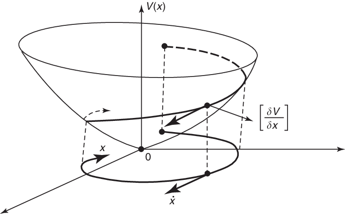
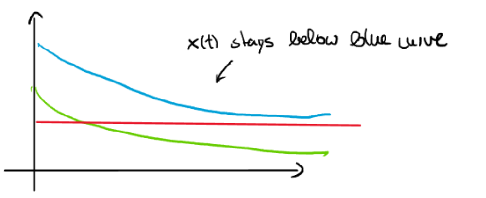

## This repository contains the contents of the lecture notes Advanced methods in Nonlinear control, as well as a summary to the course and exercises 

- the **lecture notes** are in [amnc](https://github.com/therealtoby1/Advanced-methods-Nonlinear-control/blob/main/amnc_ss24.pdf)
- the respective **lecture note summary** is in [Advanced Methods in Nonlinear control summary](https://github.com/therealtoby1/Advanced-methods-Nonlinear-control/blob/main/Advanced%20Methods%20in%20Nonlinear%20control%20summary.pdf)
- The **exercise tasks** can be found in the [Tasksheet](https://github.com/therealtoby1/Advanced-methods-Nonlinear-control/blob/main/Tasksheet.pdf)
- the **official solution** is in [solution](https://github.com/therealtoby1/Advanced-methods-Nonlinear-control/blob/main/solution.pdf)
- the **solution by hand** is in [Übungsaufgaben](https://github.com/therealtoby1/Advanced-methods-Nonlinear-control/blob/main/%C3%9Cbungsaufgaben.pdf)
- the **solutions to the coding exercises** are provided as jupyter notebook files [Aufgabe 2-1](https://github.com/therealtoby1/Advanced-methods-Nonlinear-control/blob/main/Aufgabe_2_1.ipynb) and [Aufgabe 4-1](https://github.com/therealtoby1/Advanced-methods-Nonlinear-control/blob/main/Aufgabe_4_1.ipynb)
  
Note that i was too lazy to create a venv and a requirements file to run the code in. All that should be needed is numpy and scipy (and matplotlib if you want to visualize the system) 

## A few important informations for each chapter of the lecture notes (for those currently studying)
### *chapter 1*
 mainly focuses on the concept of Lyapunov stability. Therefore the student should be able to geometrically interpret, what a Lyapunov  function actually does and why a positive definite function candidate is necessary and why it is important that the function is strictly increasing (in some intervall). The theorem of Krasovsky Lasalle will also be very important in the context of passivity later on. also at the end you should be able to understand and utilize integrator backstepping.

Answer: 

 strictly increasing means that the gradient of the function with regard so x always points outwards, and the scalar product of $\frac{dV}{dx}\cdot\dot{x}=\frac{dV}{dt}$ can be used to verify whether the  of the solution converges into the origin. The theorem of Krasovky Lasalle basically tells us that we converge into the largest subset where $\frac{dV}{dt}=0$. If that subset is defined by **only** the origin, the system is asymptotically stable.  

### *chapter 2* 
focuses on the concept of passivity and storage functions. A storage function contains all the energy components that occur in a physical system (e.g potential energy, kinetic energy...). The idea is to use these functions as Lyapunov function candidates, as the energy function is positive definite. Now there are a couple of cases
1. the system is **strictly state passive** . This is the best possible case, because using simple output feedback $u=-ky$, we do not only converge to 0 for the measured output y, but also for every state x-->asymptotic stability. 
2. the system is **passive**. In this scenario, using $u=-ky$ **may** lead to asymptotic stability. What may also happen is that the system converges to a point where y=0, but the other states are not necessarily 0. Because the ||x|| term (from strictly state passive systems) is missing, the derivative may be 0 before all states are 0. To verify that the system actually converges one could either :

    a.)
    
     Confirm if the system is zero state observable: **zero state observability** in essence means this:$$y = 0 \rightarrow x = 0$$
That means: A passive system converges for $u=-ky$ to $y=0$ and because of the zero state observability property we know that all other states are also 0.
As a side note: if the system is not zero state observable, you could still try to check for **zero state detectability**. this would indicate that for $$y = 0 \rightarrow x \rightarrow 0$$ So all solutions converge into a subset in which the origin is the main attractor

    b.)
    
    Use the **Theorem of Krasovsky-Lasalle**. This kind of also uses the same logic, as the 2.a). We basically know, that we converge into the largest positive invariant subset for which y=0 and then we check that the largest positively invariant subset for which y=0 also means that x=0 
3. System is not passive. Maybe it can be passivied using input feedback (similar to Nonlinear process control). Here, one would just have to check that the zero dynamics are actually stable. 

### *chapter 3*
In this chapter focus is understanding the concept of  **Input to state stability (ISS)**. Fundamentally a system is ISS if it fulfills the 

- **0-GAS** property (leads to blue)
- **Asymptotic gain** property (leads to red (not directly red because the AG-property uses lim_sup))

if a system does not fulfill these it is not necessary to check further for Lyapunov gain functions (the thing with the $\epsilon$ ).
Example: $$\dot{x} = x^3 - x u$$ is NOT an ISS System, because it does not fulfill the 0 Gas Property.$$\dot{x} = -x^3 - x u$$ on the other hand fulfills the 0-GAS Property

combing these criteria leads to this equation: $$ \color{blue}{|\phi(t, x_0, u)|} \leq \color{green}{\beta}(|x_0|, t) + \color{red}{\gamma(\|u\|_\infty)}$$ 

where $\beta$ describes the transient behavior and $\gamma$ describes the influence of the input. 

In that context, comparision functions are introduced to help with the notation.
Veryfing ISS and figuring out the bounds for a system without disturbance can also be done by use of comparision functions and introduction of the  $\epsilon$ notation. Side note: the resulting Lyapunov gain is **NOT** related to the beta or gamma function above, it simply shows us that these exist.

Later, when introducing an unknown **disturbance** $d$ to specific system types, it is attempted to find an input $u$ for which the system is still ISS. We basically "sacrifice" parts of the input to compensate for the disturbance. Often these inputs do not result in asymptotic convergence to the origin, but ensure that the output is bounded even though there is an external disturbance.

